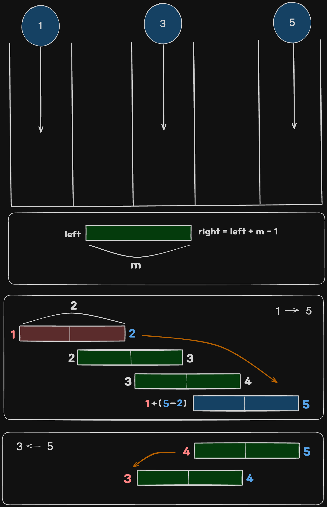

## [[2828] 사과 담기 게임](https://www.acmicpc.net/problem/2828)
상근이는 오락실에서 바구니를 옮기는 오래된 게임을 한다. 스크린은 N칸으로 나누어져 있다.

스크린의 아래쪽에는 M칸을 차지하는 바구니가 있다. (M < N) 

플레이어는 게임을 하는 중에 바구니를 왼쪽이나 오른쪽으로 이동할 수 있다. 

하지만, 바구니는 스크린의 경계를 넘어가면 안 된다. 가장 처음에 바구니는 왼쪽 M칸을 차지하고 있다.

스크린의 위에서 사과 여러 개가 떨어진다. 

각 사과는 N칸중 한 칸의 상단에서 떨어지기 시작하며, 스크린의 바닥에 닿을때까지 직선으로 떨어진다. 

한 사과가 바닥에 닿는 즉시, 다른 사과가 떨어지기 시작한다.

바구니가 사과가 떨어지는 칸을 차지하고 있다면, 바구니는 그 사과가 바닥에 닿을 때, 사과를 담을 수 있다. 

상근이는 사과를 모두 담으려고 한다. 이때, 바구니의 이동 거리의 최솟값을 구하는 프로그램을 작성하시오.

## 입력
첫째 줄에 N과 M이 주어진다. (1 ≤ M < N ≤ 10) 둘째 줄에 떨어지는 사과의 개수 J가 주어진다. (1 ≤ J ≤ 20) 다음 J개 줄에는 사과가 떨어지는 위치가 순서대로 주어진다

## 출력
모든 사과를 담기 위해서 바구니가 이동해야 하는 거리의 최솟값을 출력한다.

***

### 풀이 코드

- [@JongHyunJung](https://github.com/almond0115/Algorithm-CodingTest/blob/main/BackJoon/DFS%2CBFS/2828/jjh.cpp)

### 모범 답안

- [Setting Coordinate](https://github.com/almond0115/Algorithm-CodingTest/blob/main/BackJoon/DFS%2CBFS/2828/solution_1.cpp)

***

### 참고 자료

 <b> 좌표 설정 idea </b> 

