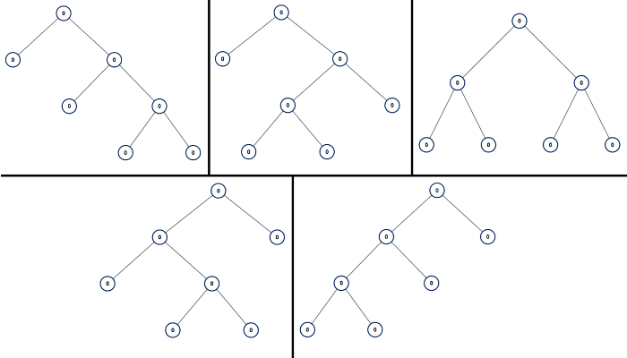

## [[894] All Possible Full Binary Trees](https://leetcode.com/problems/all-possible-full-binary-trees/)

Given an integer n, return a list of all possible full binary trees with n nodes. 

Each node of each tree in the answer must have Node.val == 0.

Each element of the answer is the root node of one possible tree. 

You may return the final list of trees in any order.

A full binary tree is a binary tree where each node has exactly 0 or 2 children.

Input: n = 7

Output: [[0,0,0,null,null,0,0,null,null,0,0],[0,0,0,null,null,0,0,0,0],[0,0,0,0,0,0,0],[0,0,0,0,0,null,null,null,null,0,0],[0,0,0,0,0,null,null,0,0]]

## 제한 사항

* 1 <= n <= 20

***

### 풀이 코드

- [@JongHyunJung](https://github.com/viaunixue/algorithm-study/blob/main/leetcode/medium/894/jjh.py)

### TIL

* [All Possible Full Binary Trees](https://almond0115.tistory.com/entry/LeetCode-894-All-Possible-Full-Binary-Trees)