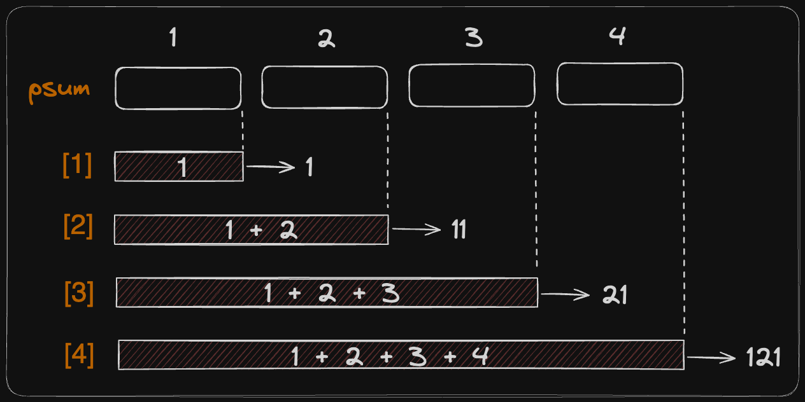

# 누적합

누적합이란 요소들의 누적된 합의 의미로 어떠한 배열을 기반으로 앞에서 부터 요소들의 누적된 합을 저장해 새로이 배열을 만들어서 이를 활용하는 것을 말합니다.

이는 앞에서부터 더하는 prefix sum과 뒤에서 부터 더하는 suffix sum 이 있습니다.

코딩 테스트에는 prefix sum 만 나오니 prefix sum만을 배우면 됩니다.



```md
승철이는 뇌를 잃어버렸다. 학교에 갔더니 선생님이 자연수로 이루어진 N개의 카드를 주면서
M개의 질문을 던진다. 그 질문은 나열한 카드 중 A번째부터 B번째까지의 합을 구하는 것이다.
뇌를 잃어버렸기 때문에 승철이는 이 문제를 풀 수 없다. 문제를 풀 수 있는 프로그램을 작성해보자.
```

```
입력
> 수의 개수 N, 합을 구해야 하는 횟수 M, 그 이후 N개의 수가 주어진다.
수는 100 이하 자연수, 그 이후 M개의 줄에는 합을 구해야 하는 구간 A, B가 주어진다.

출력
> M개의 줄에 A부터 B까지의 합을 구하라

범위
1 <= N <= 100,000
1 <= M <= 100,000
1 <= A <= B <= N
```

```
예제 입력
$ 8 3
$ 1 2 3 4 5 6 7 8
$ 1 4
$ 1 5
$ 3 5

예제 출력

```

```c++
#include <bits/stdc++.h>

using namespace std;

int a[100004], b, c, psum[100004], n, m;

int main() {
    cin >> n >> m;
    for (int i=1; i<=n ; i++) {
        cin >> a[i];
    }

    for (int i=0 ; i<m ; i++) {
        cin >> b >> c;
        int sum = 0;
        for (int j=b ; j <= c ; j++) sum += a[j];
        cout << sum << '\n';
    }

    return 0;
}
```
#### 이렇게 코드를 짜게 되면 `10만 X 10만 (100억)` 시간복잡도를 가지게 됩니다.
#### 따라서 아래와 같은 누적합으로 풀이를 하는 것이 효율적입니다.

```c++
#include <bits/stdc++.h>

using namespace std;

typedef long long ll;
int a[100004], b, c, psum[100004], n, m;

int main() {
    ios_base::sync_with_stdio(false); cin.tie(NULL); cout.tie(NULL);
    cin >> n >> m;
    for (int i=1 ; i<=n ; i++) {
        cin >> a[i];
        psum[i] = psum[i-1] + a[i];
    }

    for (int i=0 ; i<m ; i++) {
        cin >> b >> c;
        cout << psum[c] - psum[b -1] << "\n";
    }

    return 0;
}
//result

// 8 3
// 1 2 3 4 5 6 7 8
// 1 4
// 10
// 1 5
// 15
// 3 5
// 12
```

#### 이렇게 코드를 짜게 되면 `10만 X 1` 시간복잡도를 가지게 됩니다.
