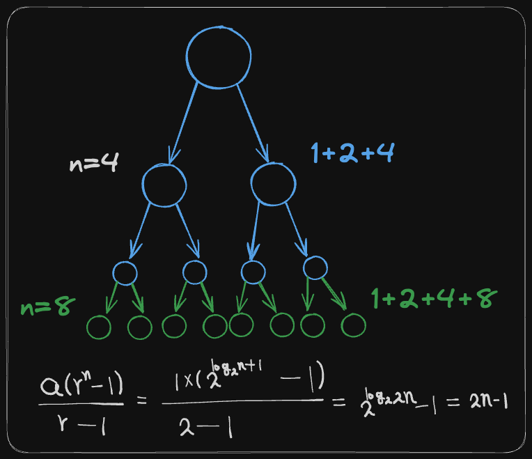

## 시간 복잡도 계산

### cnt 값으로 디버깅하면서 몇 번 반복되는지를 통해 시간복잡도를 결정합니다.

```c++
#include <bits/stdc++.h>

using namespace std;

int n, cnt;

int main() {
    cin >> n;
    int a = 0;
    
    for(int i=0; i < n ; i++){
        for(int j=0 ; j < i ; j++){
            a += i + j;
            cnt ++;
        }
    }

    cout << a << '\n';
    cout << "cnt : " << cnt << '\n';
    return 0;
}
// result

// 3
// 6
// cnt : 3

// 4
// 18
// cnt : 6

// 5
// 40
// cnt : 10

// 6
// 75
// cnt : 15
```

<br>

### cnt 값 디버깅을 기반으로 점화식을 만들어 시간복잡도를 파악해야 합니다.
&rarr; 어려우므로 시간이 남으면 체크

```c++
#include <bits/stdc++.h>

using namespace std;

int n, a[1004], cnt;

int go(int l, int r) {
    cnt++;
    if (l == r) return a[l];
    int mid = (l + r) / 2;
    int sum = go(l, mid) + go(mid + 1, r);
    return sum;
}

int main() {
    cin >> n;
    
    for (int i=1 ; i<=n ; i++) {
        a[i-1] = i;
    }

    int sum = go(0, n-1);
    cout << sum << '\n';
    cout << "cnt : " << cnt << '\n';
}
// result

// 10
// 55
// cnt : 19

// 5
// 15
// cnt : 9
```



<br>

### 로그(log)는 지수 함수의 역함수입니다. 

```c++
#include <bits/stdc++.h>

using namespace std;

int N, cnt;

void solve(int N) {
    int a = 0, i = N;
    while (i > 0) {
        a += i;
        i /= 2;
        cnt ++;
    }
    cout << a << '\n';
    cout << "cnt : " << cnt << '\n';
}

int main() {
    cin >> N;
    solve(N);
    return 0;
}

// result

// 32
// 63
// cnt : 6

// 16
// 31
// cnt : 5
```

<br>

### 재귀함수 = Main Logic x 함수 호출
&rarr; 보통의 재귀함수는 순차적으로 go(idx-1), go(idx+1)...구조를 가지므로 보통 호출이 2번 일어나면 2^n, 3번 일어나면 3^n이라고 보면 됩니다. <br> 다만 저러한 구조를 가지지 않은 함수의 경우 다른 시간 복잡도를 가지기도 합니다. Ex) go(idx/2) 로 호출되는 등.. 

```c++
#include <bits/stdc++.h>

using namespace std;

int N, cnt;

void solve(int N) {
    cnt++;
    cout << cnt << '\n';
    if (N == 0) return;
    for(int i=0 ; i<3 ; i++) {
        solve(N-1);
    }
    return;
}
 
int main() {
    cin >> N;
    solve(N);
    return 0;
}

// result

// n=3 -> (1+3+3^2+3^3) 40번 호출
```


