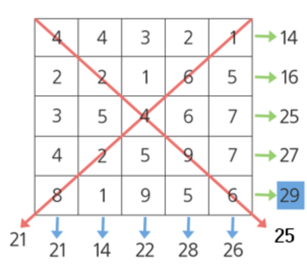

## [[1209] Sum](https://swexpertacademy.com/main/code/problem/problemDetail.do?contestProbId=AV134DPqAA8CFAYh)

다음 100X100의 2차원 배열이 주어질 때, 각 행의 합, 각 열의 합, 각 대각선의 합 중 최댓값을 구하는 프로그램을 작성하여라.

다음과 같은 5X5 배열에서 최댓값은 29이다.

## 제한 사항

총 10개의 테스트 케이스가 주어진다.

배열의 크기는 100X100으로 동일하다.

각 행의 합은 integer 범위를 넘어가지 않는다.

동일한 최댓값이 있을 경우, 하나의 값만 출력한다.

## 입력

각 테스트 케이스의 첫 줄에는 테스트 케이스 번호가 주어지고 그 다음 줄부터는 2차원 배열의 각 행 값이 주어진다.

***

### 풀이 코드

- [@JongHyunJung](https://github.com/viaunixue/algorithm-study/blob/main/sw-expert-academy/1209/jjh.py)

### TIL

* [View, Flatten, Sum](https://almond0115.tistory.com/entry/SWEA-View-Flatten-Sum)