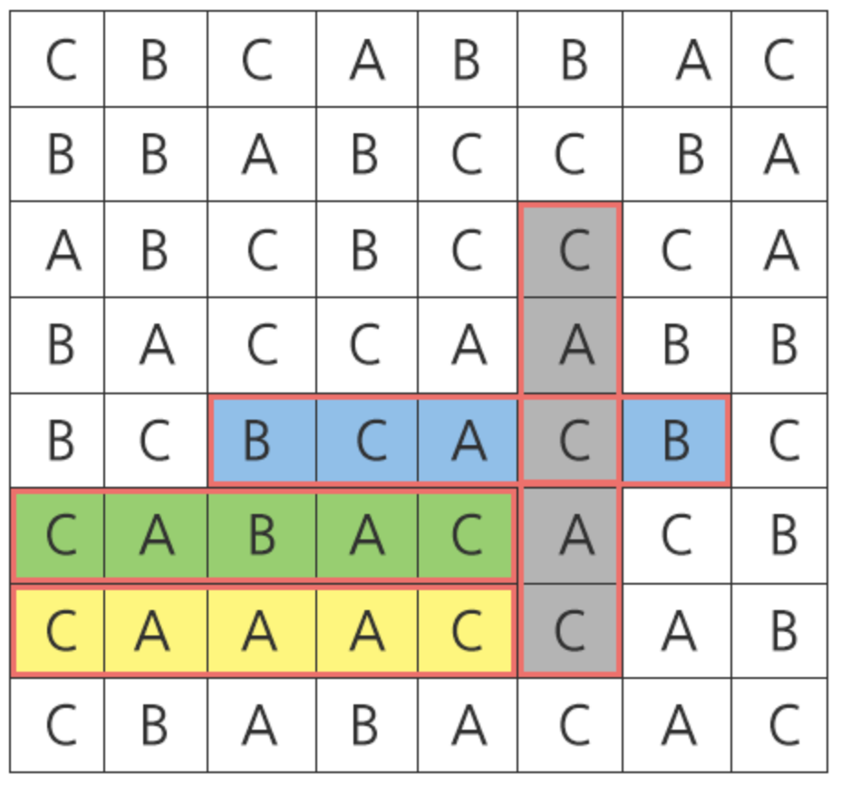

## [[1215] 회문](https://swexpertacademy.com/main/code/problem/problemDetail.do?contestProbId=AV14QpAaAAwCFAYi)

"기러기", "토마토", "스위스"와 같이 똑바로 읽어도 거꾸로 읽어도 똑같은 문장이나 낱말을 회문(回文, palindrome)이라 한다.

8x8 평면 글자판에서 제시된 길이를 가진 회문의 개수를 구하라.

위와 같은 글자판이 주어졌을 때, 길이가 5인 회문은 붉은색 테두리로 표시된 4개이므로 4를 반환하면 된다.

## 제한 사항

각 칸의 들어가는 글자는 'A', 'B', 'C' 중 하나이다.

ABA도 회문이며, ABBA도 회문이다. A 또한 길이 1짜리 회문이다.

가로 또는 세로로 이어진 회문의 개수만 센다.

아래 그림에서 노란색 경로를 따라가면 길이 7짜리 회문이 되지만 직선이 아니기 때문에 인정되지 않는다.

## 입력

총 10개의 테스트 케이스가 주어진다.

각 테스트 케이스의 첫 번째 줄에는 찾아야 하는 회문의 길이가 주어지며, 다음 줄에 8x8 크기의 글자판이 주어진다.

***

### 풀이 코드

- [@JongHyunJung](https://github.com/viaunixue/algorithm-study/blob/main/sw-expert-academy/1215/jjh.py)

### TIL

* [회문 1, 회문 2, 거듭제곱](https://almond0115.tistory.com/entry/SWEA-회문-1-회문-2-거듭제곱)